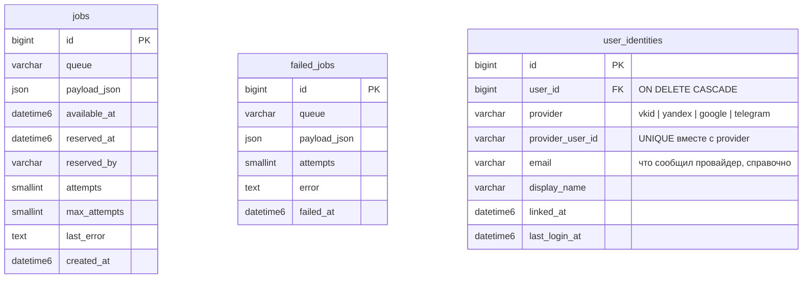
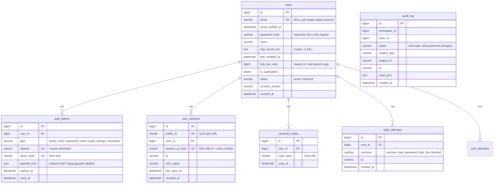

# Схема БД

Статус: этап 01 — созданы только служебные таблицы очереди. Миграции лежат в `database/migrations/` (файл возвращает анонимный класс `Migration` с `up()` и `down()`); каждая миграция обновляет этот документ.

Общие правила: MySQL 8.0, InnoDB, `utf8mb4_unicode_ci`, время в UTC (`DATETIME(6)`), деньги — `BIGINT` в минимальных единицах. Ключевые таблицы и связи — `docs/plans/00-master-plan.md` §4.3.

Базы в dev: `app` (приложение) и `app_test` (тесты, создаётся `docker/mysql/init/01-test-db.sql` при первом старте MySQL; для пересоздания: `docker compose down -v`).

## Служебные таблицы

`migrations(id, migration UNIQUE, batch)` — учёт применённых миграций (создаётся `Migrator`).

`jobs` и `failed_jobs` — очередь задач (подробности и жизненный цикл в `queue.md`):

### Аутентификация (этап 02)

Связанные таблицы удаляются каскадом вместе с пользователем. `audit_log` без внешних ключей: журнал переживает удаление пользователей. Счётчики неудачных входов хранятся в Redis (`auth:fail:*`, `auth:lock:*`), а не в БД.

Команды: `make migrate`, `make console CMD="migrate:status"`, `migrate:rollback` (последний batch), `migrate:fresh` (удаляет все таблицы; в production отключена), `seed` (dev-данные из `database/seeds/`; в production отключена).
